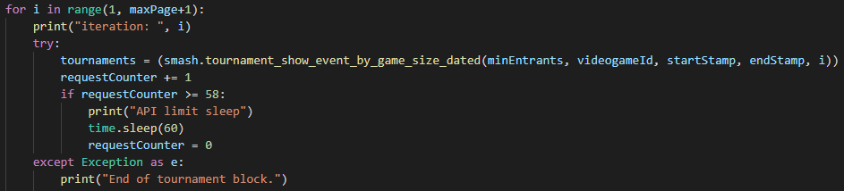

# K-Means SSBU/M Player Power Ranking

## Introduction

This is a k-means approach to tiering players that compete often and consistently place in the top ranks.

The goal for this solution is to create a handy method of generating dately power rankings for seeding tournaments, amusement, and strategizing.

---

## Used Technologies

Most importantly, this algorithm is fed from smash.gg's GraphQL API that's open for 3rd party developers. [Link](https://developer.smash.gg/docs/intro/) (named SGA onwards)  
You will need to get your own Developer Account API Key to use the endpoint.

Used [JeremySkalla's Wrapper](https://github.com/JeremySkalla/pysmashgg) for quicker use of requests and calls to the API.

SciKit-Learn's Toolkit, as the framework to run the clustering algorithms with.

Python 3.9

Jupyter Notebook

## Preproduction

Using this tool, we want to create a tier list that can tell us how consistent a player is at ranking in the top spots, specifically in Super Smash Bros. Ultimate or Super Smash Bros. Melee.  
In order to obtain this, we need to select what we will be ranking the players against.  
In order to have useful placement data, it was decided to only use tournaments with at least 50 confirmed participants. This will provide the system the possibility for less variance, a standarized minimum, and leave out small local, outlying tournaments.  
Due to restrictions on querying SGA, all responses are paginated, with a limit of 10,000 elements. So if we query for ALL tournaments ever created on the platform, we would only be able to work with the most recent (or oldest) 10,000.  
Therefore, we also have date delimiters. We give the query a start and end date to search for tournaments.  The SGA does not have filtering by number of entrants, so we will have to apply that filter ourselves when querying for tournaments.  
Additionally, there's 3 different files that pull different datasets. The first one gets a basic 2D matrix to check distances between each point and a centroid in two coordinates.  
The second file adds a 3rd axis, and now does a K-Means Clustering comparison to find the centroids across 3 dimensions.  
And finally, the third option will only query the top placing player from each tournament, if you're more interested in the highest level competition, rather than mid-tier PR.

## Building the Dataset

Calls to the SGA is limited to specific filters, schemas, and object types.  
In order to get the necessary dataset to run, we need to do nested queries. Smash.gg has an option to run a query inside a query, but it is limited to 1,000 elements from a single call to the SGA. Therefore, we need to loop calls to get through the pagination AS WELL as to avoid the data limit. Another restriction set in places is that we cannot exceed 60 API calls per minute, so when we're about to reach that number, we call a sleep timer to wait out the limit.  
Once we have our first page of tournaments queried, we need to filter out those that have less participants than we require.  

This is done on the function `tournament_show_event_by_game_size_dated()`. It will discard and not return tournaments that don't meet the participant minimum. Because of pagination, we're limited to querying 32 non-filtered tournaments, to then grab the ones we need. It also takes in a `videogameId`, which we can change for whatever game we want. In this case, I was working with SSBU, but if you change the id to 1, you'll pull SSBM tournaments.  
Once a tournament is shown as useful, we iterate through its participants, also paginated, and grab their name, placement, and id, 64 at a time.

## Running the clustering algorithms

Once we've got our dataset ready, it's time to analyze it. This solution utilizes SciKit-Learn's Toolkit, an excellent framework that does the calculating for us.

We will need to load our .csv of player information like so. If you're on the 3D files, you'll see the `z` variable also gets a value assigned.

After that, let's create our data array that will be used to plot and feed data to the clustering algorithm.

Run the plotting function to see how your data is presented without any clustering.

Now, set however many clusters you're looking for and run the clustering algorithm. Scroll down until you see the graph that has each point assigned a label, and therefore, a tier.

Each color will represent its own tier (cluster).

What happened behind the scenes, was the algorithm randomly getting N amount of centroids. The first iteration of the algorithm is looking for the points closest to each centroid. They get assigned the same label the centroid got at the beginning, and then the mean position across all points labeled the same is calculated. That is your new centroid for iteration 2.  
This process is repeated however many times it is necessary and possible, ending once a centroid's "old" coordinates are equal to the "new" ones.

## Variances

### 3D Variant

There's a second Jupyter Notebook that you can experiment with, with its own Python file to load the database with a 3rd variable. This time, you're also comparing how many times each player made the Top 8 or Top 16 cut-off. This can also provide additional information to how consistent each player is, when playing at the top of their level in a tournament.

Similar to the process we just covered, you will follow the same steps, but this time on the files marked `3D`.

Once done, you should get something like this:

This 3D graph shows the 3 tiers of players, compared against their average placement across however many tournaments they entered, plus additionally how many tournaments they've placed in the Top 8/16 cut-off.

### Top Player Variant

In order to use the "Top Play Variant", you must construct your dataset using the `3D Pro` Python file.

Afterwards, follow the same procedure as the 3D variant on the Jupyter Notebook, just make sure to load the correct .csv file!!

---

## Join the discussion

https://old.reddit.com/r/smashbros/comments/qzmjlt/i_created_a_tool_that_gives_you_a_power_ranking/
